---
hide:
  - toc
---

# Entrada na Aplicação

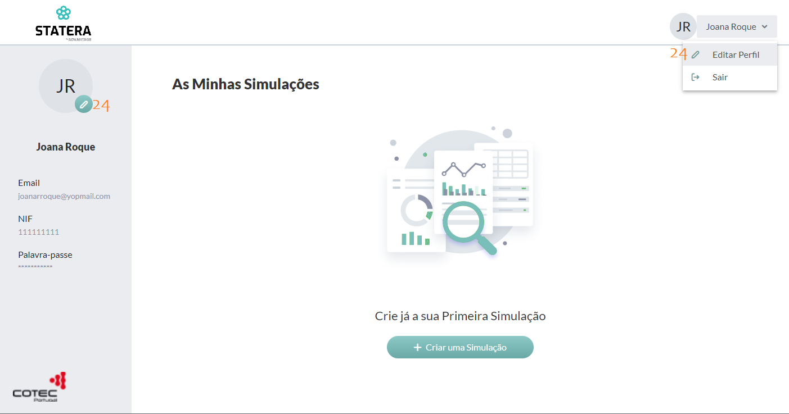

Após o Login, caso o utilizador não tenha ainda nenhuma simulação financeira criada, vê este ecrã.

Uma das coisas que o utilizador pode fazer aqui é editar o seu perfil, clicando num, dos dois sitios possiveis (_24_).

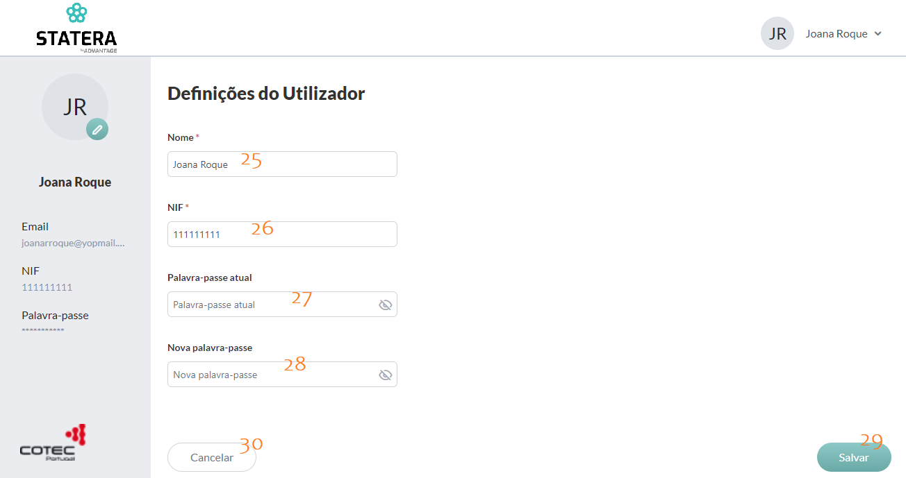

O Utilizador pode alterar o nome (_25_), o NIF (_26_) e/ou a palavra-passe, colocando a “palavra-passe atual” (_27_) e a “nova palavra-passe" (_28_).

Após o preenchimento, carregar no botão “Salvar” (_29_), ou, se nao pretender alterar o perfil, escolher o botão “Cancelar” (_30_).

Criar uma simulação

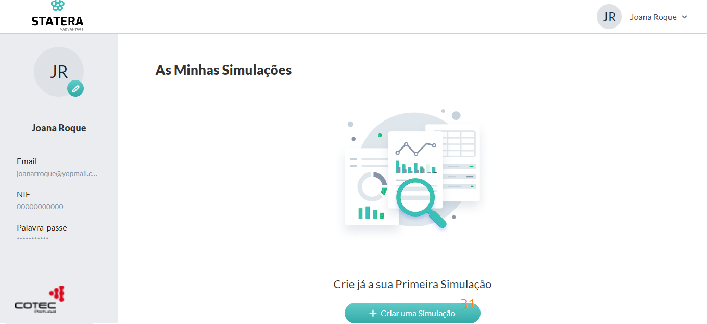

Para criar uma simulação, carregar no botão “Criar uma simulação” (_31_)

**1. Caracterização da Empresa (Primeiro passo)**

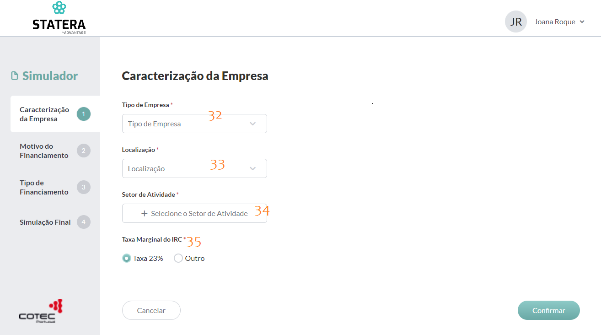
    
Este é o primeiro passo para a criação da simulação, aqui o utilizador escolhe o “Tipo de Empresa” (_32_), a “Localização” (_33_), o “Setor de Atividade” (_34_) e a “Taxa Marginal do IRC” (_35_).

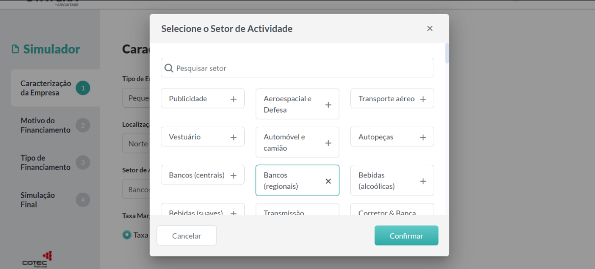

Ao carregar no setor de atividade (_34_), é aberta esta janela, que contem todos os setores de atividade e onde é possivel filtrar a pesquisa, escrevendo o nome que se pretende.

Ao escolher um, carregar no botão “Confirmar” e esta janela é fechada.

Após o preenchimento de todos os campos, se pretender avançar, o utilizador carrega em “Confirmar”, se não, carrega em “Cancelar”.

**2. Motivo do Financiamento (Segundo passo)**

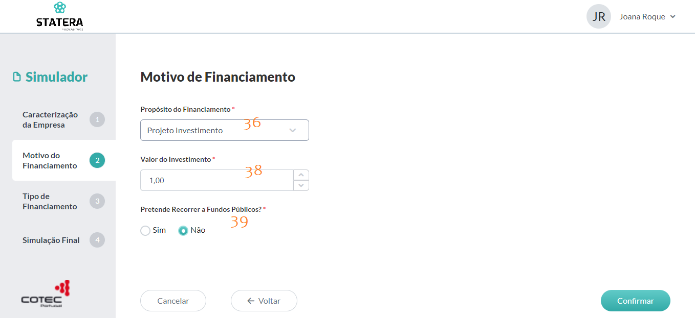

No segundo passo da simulação financeira, o utilizador escolhe o “Propósito de Financiamento” (_36_) e, caso escolha a opção “Outros”, terá que preencher o campo (_37_), seguindo-se o “Valor do Investimento” (_38_).

Se não pretender recorrer a fundos públicos (_39_) pode avançar, carregando em “Confirmar”.

Caso pretenda recorrer a fundos públicos, surgem mais campos a serem preenchidos:

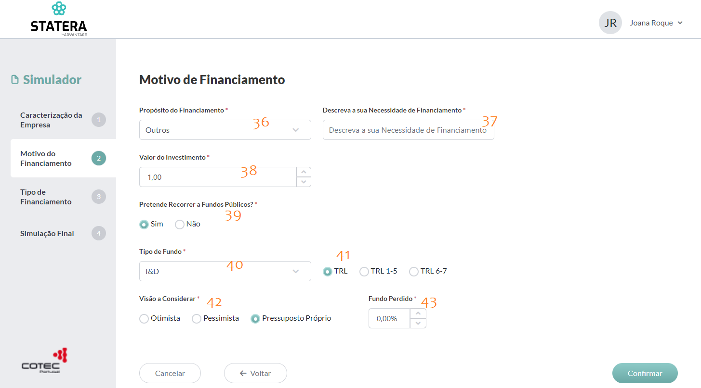

No “Tipo de Fundo” (_40_), se escolher a opção “I&D”, terá que escolher uma das três opções que aparecem (_41_).

Bem como na “Visão a Considerar” (_42_), se escolher a opção “Pressuposto Próprio”, terá que escolher a percentagem a “fundo perdido” (_43_).

Após este segundo passo preenchido, pode escolher: “Cancelar”, “Voltar” ou “Confirmar”.

**3. Tipo de Financiamento (Terceiro passo)**

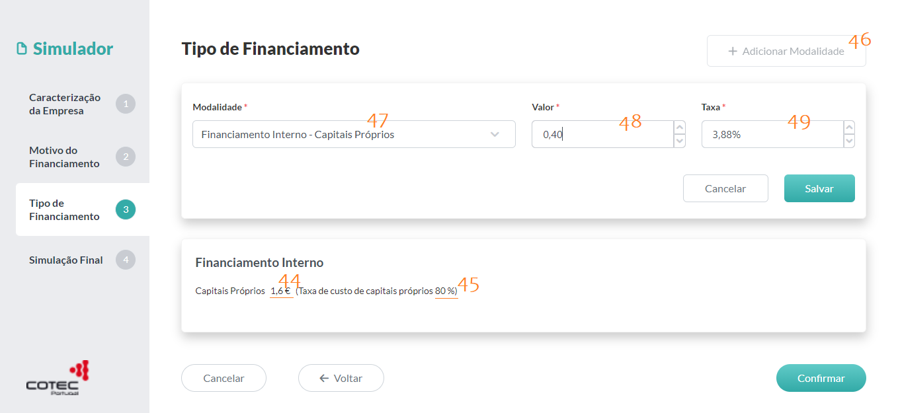

No terceiro passo, consoante o que é escolhido nos campos: _32_, _33_, _34_, _35_, _36_, _38_, _39_, _40_ e _42_, é caulculado automáticamente o valor do financiamento (_44_) e o valor da taxa (_45_).

Para avançar para o passo seguinte, é obrigatório perfazer o valor do investimento (_38_), no campo “valor” (_48_), para isso, o utilizador terá que carregar no botão “Adicionar Modalidade” (_46_).

Ao escolher uma das três opções de modalidade (_47_), é calculada automaticamente a taxa (_49_). 

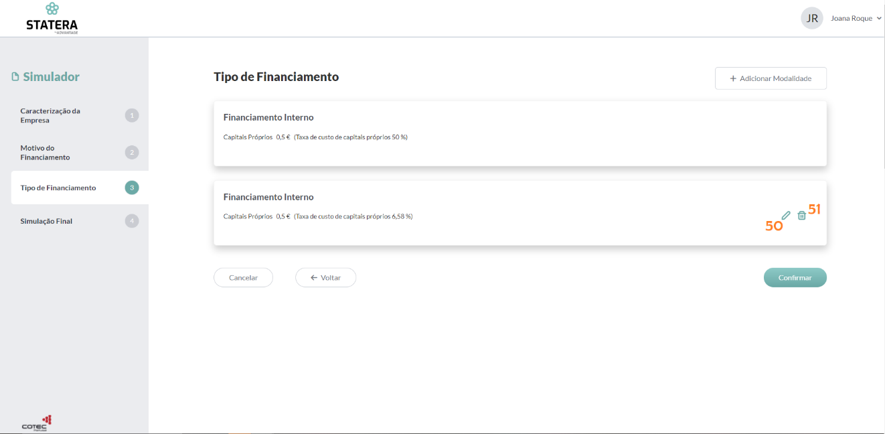

No símbolo do lápis (_50_) é onde o utilizador pode editar a modalidade que criou (a modalidade criada pelo sistema nao é editavel). E no símbolo do caixote do lixo (_51_) é onde o utilizador pode apagar a modalidade de financiamento que criou.

Após o preenchimento, se escolher avançar para último passo, carrega no botão “Confirmar”.

**4. Simulação Final (quarto e último passo)**

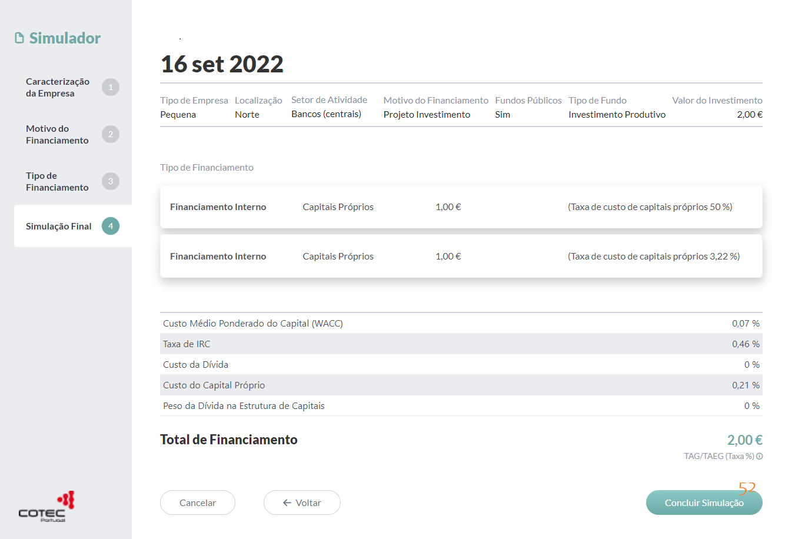

No quarto e último passo, mostra um resumo do que foi escolhido, onde são observadas as escolhas do utilizador nos passos anteriores.

Nesta altura, o utilizador pode sempre voltar a qualquer um dos passos anteriores e alterar, ou não, algum dos campos.

Para concluir a simulação financeira carregar no botão “Concluir simulação” (_52_).

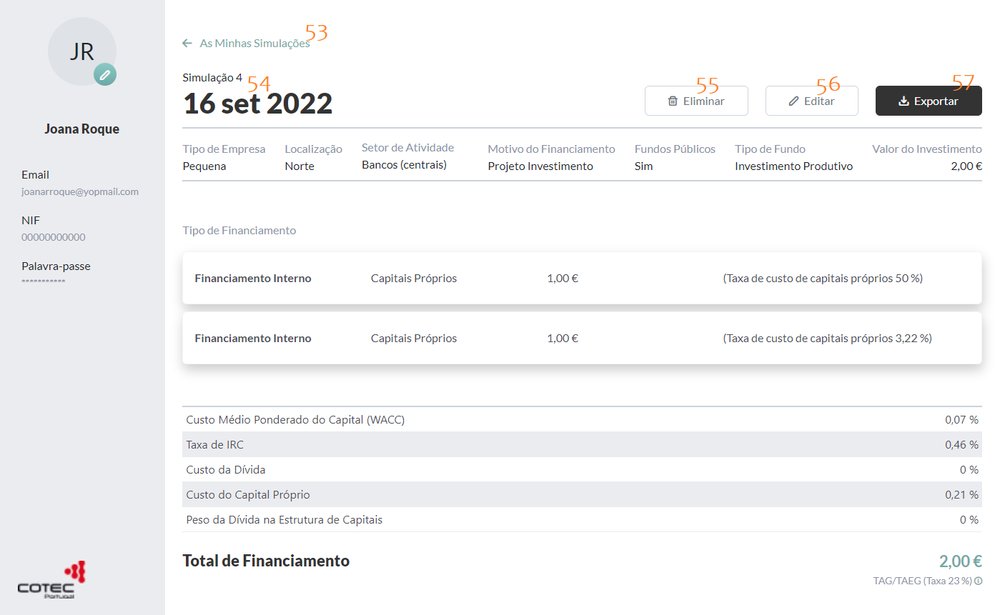

A simulação está criada, o utilizador pode aqui eliminá-la (_55_), editá-la (_56_) ou exportá-la (_57_).

Nome da simulação (_54_) e Data da simulação (_54_)

Para voltar para a página inicial, carregar em “As Minhas Simulações” (_53_)

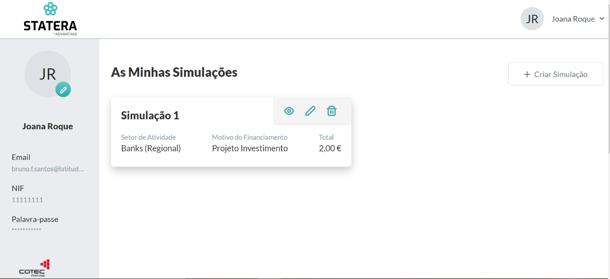

Esta é também a página que o utilizador vê, após o Login, caso ja tenha alguma simulação feita anteriormente.
