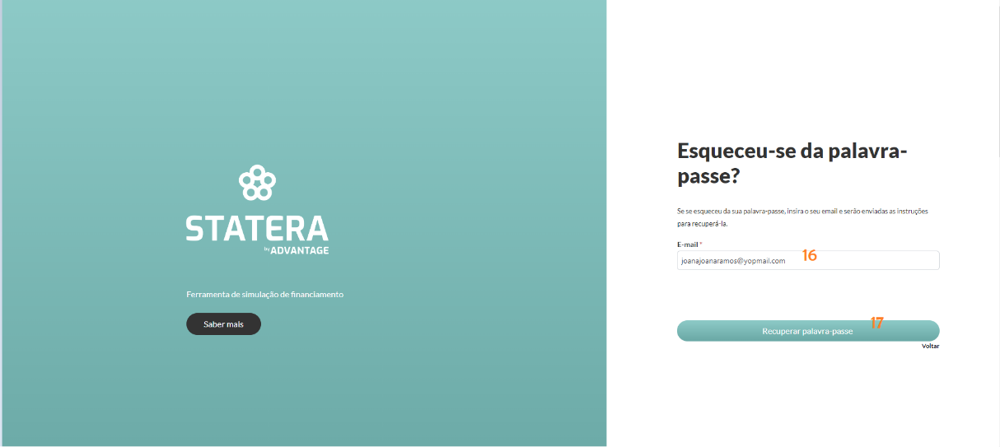
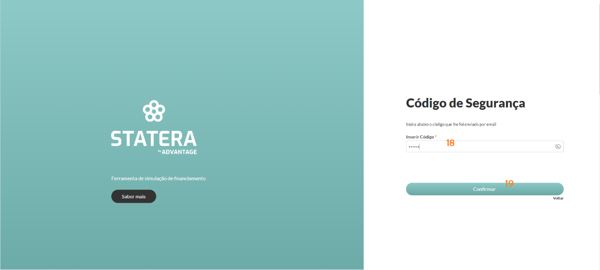
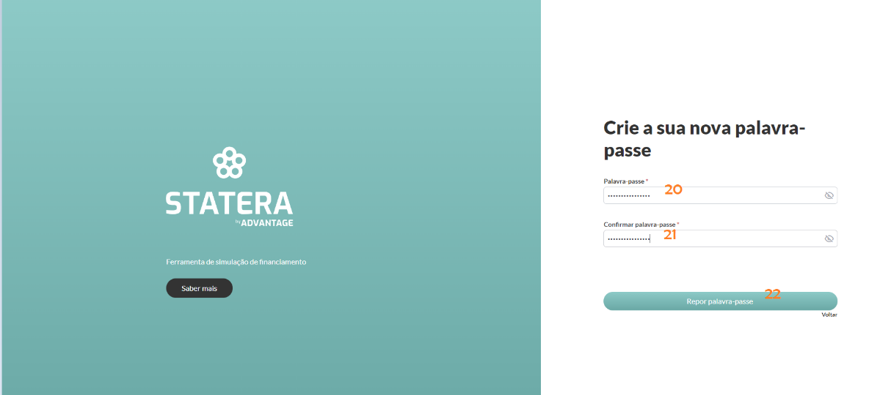
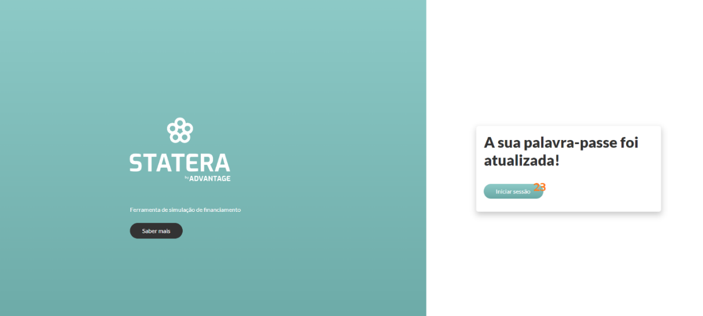

---
hide:
  - toc
---

# Pedido de Nova Palavra-Passe

Para fazer o pedido de nova palavra-passe, carregar “Esqueceu-se da palavra-passe”. 

Preencher o email (_16_) e carregar no botão “Recuperar palavra-passe" (_17_).

Preencher o campo “inserir código” (_18_), recebido para o email colocado no passo anterior e carregar no botão “Confirmar” (_19_).

Preencher a “palavra-passe” (_20_) e “confirmar palavra-passe" (_21_). 

Após isso, carregar no botão “Repor palavra-passe" (_22_).

Ao carregar em “Iniciar sessão” (_23_), o utilizador é redirecionado para o Login, novamente.
