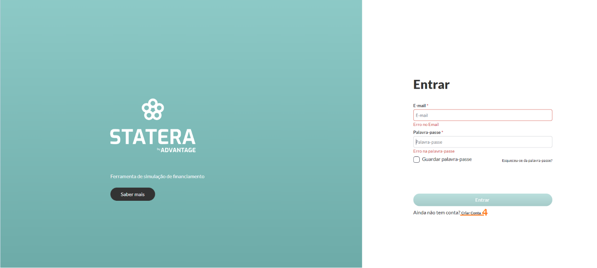
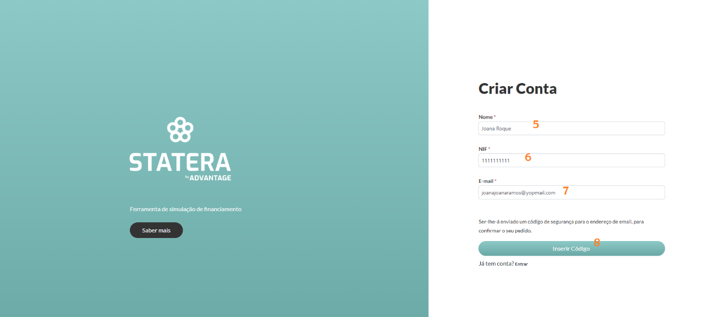
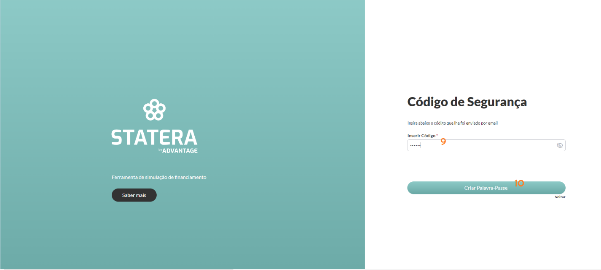
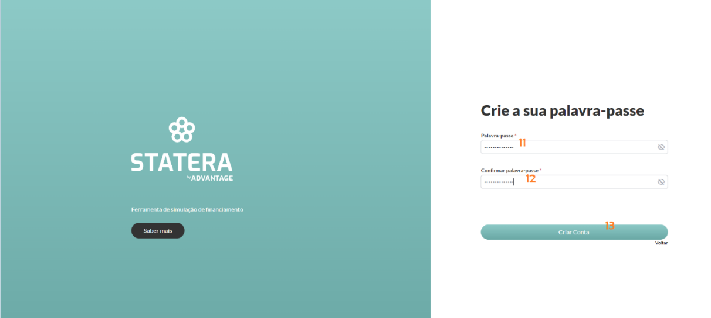
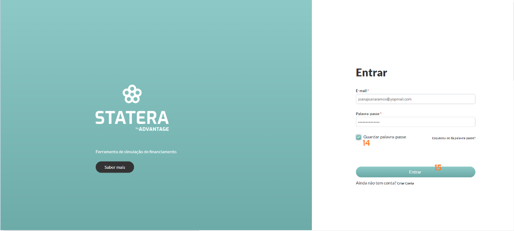

---
hide:
  - toc
---

# Registo

No caso de ser um novo registo, o utilizador pode carregar em “Criar Conta” (_4_), que o leva para o ecrã “Criar Conta”, onde coloca o nome (_5_), o NIF (_6_) e o email (_7_).

Após o preenchimento, carrega no botão “Inserir Código” (_8_). Este botão faz efetua o pré-registo na aplicação e envia um código de validação para o email indicado.

O utilizador deve colocar o código, recebido por email, em “inserir código” (_9_) e carregar em “Criar Palavra-Passe" (_10_).

Introduzir a Palavra-passe (_11_) e em “Confirmar palavra-passe" (_12_), colocar a mesma, pois só assim é criada uma conta. 

Após o preenchimento carregar no botão “Criar Conta” (_13_).

Preencher os campos e, opcionalmente, "Guardar a palavra-passe" (_14_). Após isto, carregar em “Entrar” (_15_).

